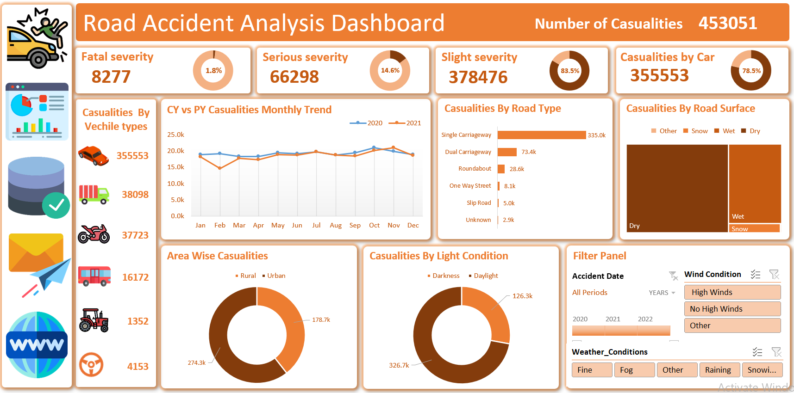

# 📊 Road Accident Data Analysis Dashboard (Excel)




## 📌 Project Overview

This project presents an **interactive Road Accident Analysis Dashboard built in Microsoft Excel** to explore accident patterns, casualty distribution, and key risk factors.

The dataset was cleaned, transformed, and analyzed using Excel features such as **Pivot Tables, Pivot Charts, and interactive Slicers**. The dashboard provides a comprehensive overview of accident severity, vehicle involvement, road conditions, and environmental factors.

The main objective of this project is to **demonstrate data analysis and dashboard development skills by transforming raw accident data into meaningful insights.**

---

## 🎯 Business Problem

Road accidents result in thousands of casualties every year. Understanding **when, where, and why accidents occur** is essential for improving road safety.

This dashboard helps answer important analytical questions such as:

* What is the total number of accident casualties?
* Which accident severity type occurs most frequently?
* Which vehicle types are involved in the most accidents?
* How do accident trends change throughout the year?
* Which road types and road surface conditions experience the most casualties?
* How do environmental factors like weather and light conditions influence accidents?

---

## 📂 Dataset Description

The dataset contains historical road accident records with multiple attributes related to accidents, vehicles, and environmental conditions.

### Key Dataset Fields

* Accident Date
* Accident Severity
* Vehicle Type
* Road Type
* Road Surface Condition
* Area Type (Urban / Rural)
* Light Condition (Daylight / Darkness)
* Weather Conditions
* Wind Conditions
* Casualties Count

---

## 🛠 Tools & Technologies

The following tools were used to complete this project:

* Microsoft Excel
* Pivot Tables
* Pivot Charts
* Data Cleaning
* Data Transformation
* Interactive Dashboard
* Slicers & Filters

---

## 🧹 Data Cleaning & Preparation

Before performing the analysis, several preprocessing steps were completed:

* Removed duplicate records
* Checked for missing or inconsistent values
* Standardized categorical values
* Created time-based fields such as **Month and Year**
* Structured the dataset for efficient Pivot Table analysis

---

## 📊 Dashboard Features

The dashboard provides an interactive overview of road accident data through multiple analytical views.

### Key Performance Indicators (KPIs)

* Total Casualties
* Fatal Casualties
* Serious Casualties
* Slight Casualties

### Analytical Visualizations

* Casualties by Vehicle Type
* Monthly Casualty Trend (Current Year vs Previous Year)
* Casualties by Road Type
* Casualties by Road Surface Condition
* Area-wise Casualties (Urban vs Rural)
* Casualties by Light Condition (Daylight vs Darkness)

### Interactive Filters

Users can explore the data dynamically using filters for:

* Accident Date
* Weather Conditions
* Wind Conditions

---

## 📈 Key Insights

From the analysis, several important insights were identified:

* **Slight severity accidents account for the majority of casualties.**
* **Cars are involved in the largest proportion of accident casualties.**
* **Single carriageway roads show the highest accident frequency.**
* **Urban areas experience more casualties compared to rural areas.**
* **Most accidents occur during daylight conditions.**

These insights can help identify key risk factors and support road safety improvement strategies.

---

## 📁 Project Structure

```
Road-accident-data-analysis-dashboard-excel-project-3/
│
├── 📁 Dashboard/
│   └── Road_Accident_Analysis.xlsx            # Main Excel file containing the interactive dashboard, pivot tables, and cleaned data
│
├── 📁 Screenshots/
│   ├── Dashboard.png                          # Visual preview of the main dashboard view
├── LICENSE                                    # MIT License file
│
└── README.md                                  # Main project documentation (overview, objectives, features, insights)

```

---

## ▶ How to Use

1️⃣ **Download:** Download the Excel file from this repository.

2️⃣ **Open:** Open the file using **Microsoft Excel**.

3️⃣ **Interact:** Use the interactive slicers and filters to explore various accident trends.

4️⃣ **Analyze:** Review the dashboard to gain data-driven insights.

---

## 🚀 Future Improvements

* **Predictive Modeling:** Build a Machine Learning model using **Python (Scikit-learn)** to predict accident severity based on environmental factors.
* **Scalable Database:** Migrate data from Excel to **SQL (PostgreSQL/SQL Server)** for better data management and faster querying.
* **Advanced Visualization:** Transition the dashboard to **Power BI or Tableau** to leverage advanced geospatial mapping and heatmaps.
* **Automated ETL:** Implement **Python scripts or Power Query** automation for real-time data cleaning and updates.
* **Live Monitoring:** Integrate **APIs** to track real-time traffic and weather data for proactive safety analysis.

---

## 👤 Author

**Alamin Refat**

**Data Analyst | Machine Learning Engineer** Passionate about turning raw data into meaningful stories through **Advanced Data Analysis** and **Business Intelligence**. I focus on creating **interactive dashboards** and **modular ML projects** that bridge the gap between technical data and business strategy.

Expertise in: **Microsoft Excel (Advanced), SQL, Python, and Machine Learning.**

---

### 🔗 Connect With Me

[](https://github.com/Alamin-refat)
[](https://www.linkedin.com/in/alaminrefat1/)
[](mailto:alaminrefat2017@gmail.com)

---

## ⭐ Support

If you found this project useful, consider **starring the repository** to support the work.

---

## ⚖️ License

This project is licensed under the **MIT License**.

You are free to use, modify, and distribute this project for personal or commercial purposes, provided that proper credit is given to the original author.

See the LICENSE file for more details.

---